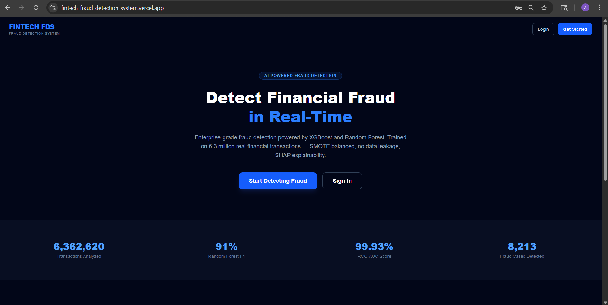
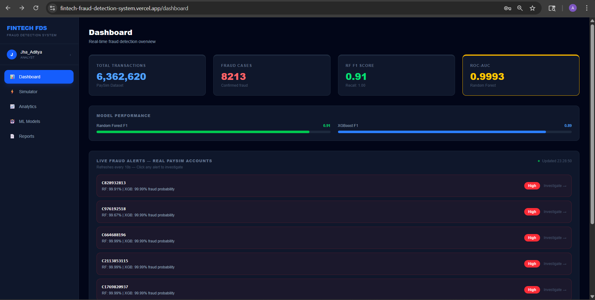
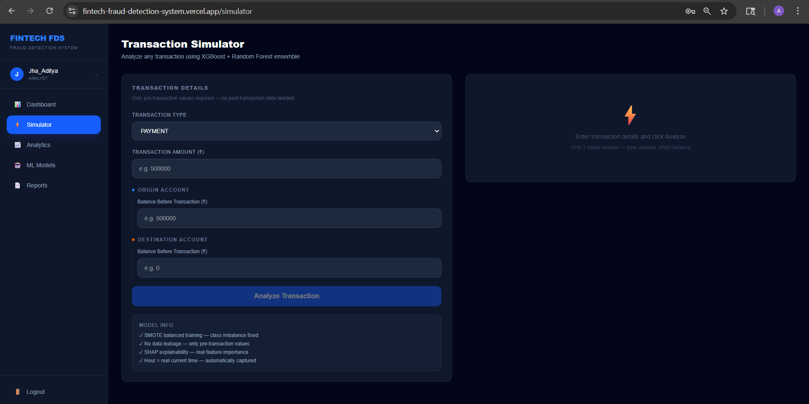
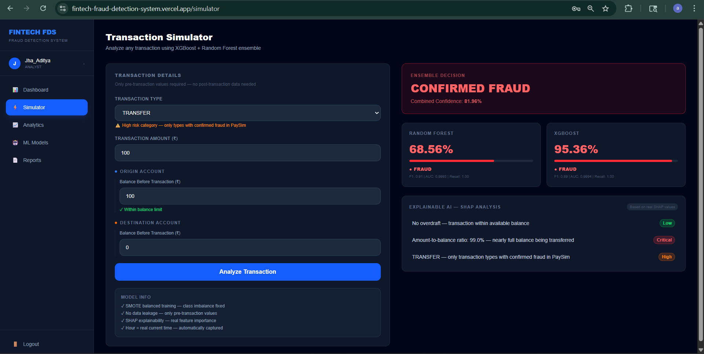
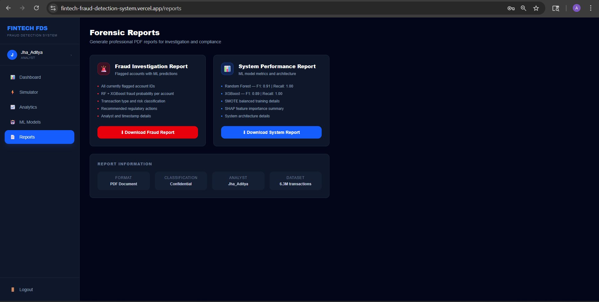
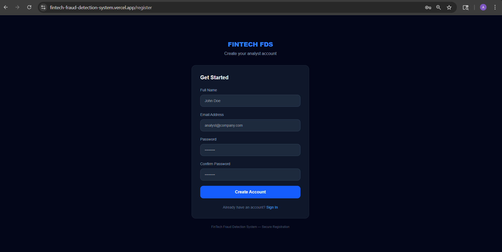

# 🛡️ FinTech Fraud Detection System

### **Enterprise-Grade Anti-Money Laundering (AML) & Fraud Analytics Platform**

A high-performance system trained on **6.3 Million transactions**, featuring a dual-engine backend, explainable AI, and real-time transaction simulation.

[](https://fintech-fraud-detection-system.vercel.app/)
[](https://github.com/AdityaJha27/fintech-fraud-detection-system)

---

## 📸 Platform Showcase

| 🛡️ Security & Authentication | 📊 Real-Time Analytics Dashboard |
| :---: | :---: |
|  |  |

| 🧪 AI Transaction Simulator | 🚩 Fraud Detection Logic |
| :---: | :---: |
|  |  |

| 📄 Forensic Case Reports | 🔐 Secure User Access |
| :---: | :---: |
|  |  |

---

## 📝 Overview

A **production-grade full-stack machine learning platform** designed for real-time financial fraud detection.
Built on the **PaySim dataset (6.3M+ transactions)**, the system prioritizes **maximum recall (1.00)** to ensure zero fraudulent activity goes undetected.

The platform integrates:

* **FastAPI** for high-speed ML inference
* **Node.js (Express)** for authentication and API handling
* **React** for an interactive analytics dashboard

---

## 🛠️ Core Technical Skills Demonstrated

### 🤖 Machine Learning & Data Science

* **Ensemble Modeling:** Combined **XGBoost + Random Forest** for robust fraud detection
* **Imbalanced Data Handling:** Solved 0.129% fraud imbalance using **SMOTE**
* **Explainable AI:** Integrated **SHAP** for transparent model predictions
* **Feature Engineering:** Designed high-impact features for improved recall
* **Data Integrity:** Eliminated data leakage for production-level reliability

---

### 💻 Full-Stack Engineering

* **Dual Backend Architecture:**

  * FastAPI (ML Inference Engine)
  * Node.js + Express (Authentication Layer)
* **Frontend:** React 18 + Vite + Tailwind CSS
* **Database:** MongoDB Atlas (Auth) + SQL-based storage (logs)
* **Security:** JWT Authentication + Bcrypt hashing

---

## 🧠 Model Details & Engineering

* **Dataset:** PaySim Synthetic Dataset (6,362,620 transactions)
* **Challenge:** Extreme class imbalance (**0.129% fraud**)

### ✅ Solution Approach

* **SMOTE:** Balanced the training dataset to eliminate bias toward non-fraud cases
* **Zero Data Leakage:** Removed future-state features (`newbalanceOrg`, `newbalanceDest`) to ensure real-time decision making
* **Custom Engineered Features:**

  * `is_overdraft` → Flags high-risk transactions
  * `amount_to_balance_ratio` → Measures transaction intensity
  * `hour` → Captures temporal fraud patterns

---

## 📊 Performance Metrics (Ensemble Results)

| Model                | F1-Score |   ROC-AUC  | Recall (Fraud) |
| :------------------- | :------: | :--------: | :------------: |
| **Random Forest**    |   0.91   |   0.9993   |    **1.00**    |
| **XGBoost**          |   0.89   |   0.9994   |    **1.00**    |
| **Ensemble (Final)** | **0.90** | **0.9995** |    **1.00**    |

> **Why Recall = 1.00?**
> In FinTech systems, missing even a single fraudulent transaction (**False Negative**) is significantly more costly than a false alarm.
> The ensemble model is optimized to ensure **zero fraud cases go undetected**.

---

## 🧱 Project Structure

```bash id="k2z8nv"
fintech_project/
├── backend/
│   ├── ml/
│   │   ├── predictor.py
│   │   ├── fintech_rf_model.pkl
│   │   ├── fintech_xgb_model.pkl
│   │   ├── fintech_scaler.pkl
│   │   ├── fintech_label_encoder.pkl
│   │   └── fintech_features.json
│   ├── config/
│   │   └── database.js
│   ├── middleware/
│   │   └── auth.js
│   ├── models/
│   │   └── user.js
│   ├── routes/
│   │   └── auth.js
│   ├── main.py
│   ├── server.js
│   └── .env
│
├── src/
│   ├── pages/
│   │   ├── Landing.jsx
│   │   ├── Login.jsx
│   │   ├── Register.jsx
│   │   ├── Dashboard.jsx
│   │   ├── Simulator.jsx
│   │   ├── Analytics.jsx
│   │   ├── MLModels.jsx
│   │   └── Reports.jsx
│   ├── components/
│   │   └── Sidebar.jsx
│   ├── context/
│   │   └── AuthContext.jsx
│   └── .env
│
├── notebooks/
│   └── Fintech_Fraud_Detection.ipynb
│
├── screenshots/
├── convert_to_sql.py
├── .gitignore
└── README.md
```

---

## 🛠️ Tech Stack

### Frontend

* React 18 (Vite)
* Tailwind CSS
* Recharts

### Backend

* FastAPI (Python)
* Node.js (Express)

### Machine Learning

* Scikit-learn
* XGBoost
* SHAP
* SMOTE

### Database

* MongoDB Atlas
* SQLite / SQL

### Deployment

* Vercel
* Render

---

## ⚙️ Setup & Installation

```bash id="4z9l3c"
git clone https://github.com/AdityaJha27/fintech-fraud-detection-system.git
cd fintech-fraud-detection-system
```

### Backend

```bash id="x5tqk8"
cd backend
pip install -r requirements.txt
python main.py
```

### Auth Server

```bash id="hf1z9w"
cd backend
node server.js
```

### Frontend

```bash id="m1c8yr"
cd frontend
npm install
npm run dev
```

---

## 🔐 Environment Variables

### 📂 Backend (`/backend/.env`)

To run this project locally, you must create `.env` files in both the frontend and backend directories. Use the following templates:

```env
MONGO_URI=your_mongodb_atlas_uri_here
JWT_SECRET=your_jwt_secret_key
PORT=5000
ML_API_URL=http://127.0.0.1:8000

```

### 📂 Frontend (/frontend/.env)

```env
VITE_ML_URL=http://127.0.0.1:8000
VITE_AUTH_URL=http://localhost:5000

```

---

## 👨‍💻 Author

**Aditya Kumar Jha**
B.Sc Computer Science — Ramanujan College

---
